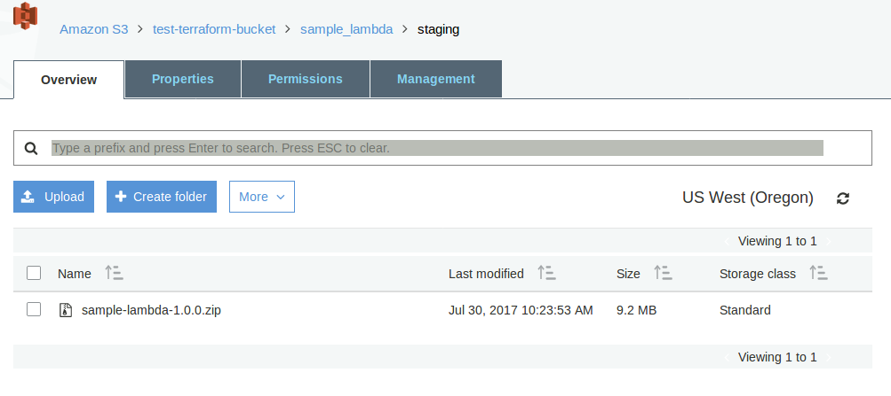
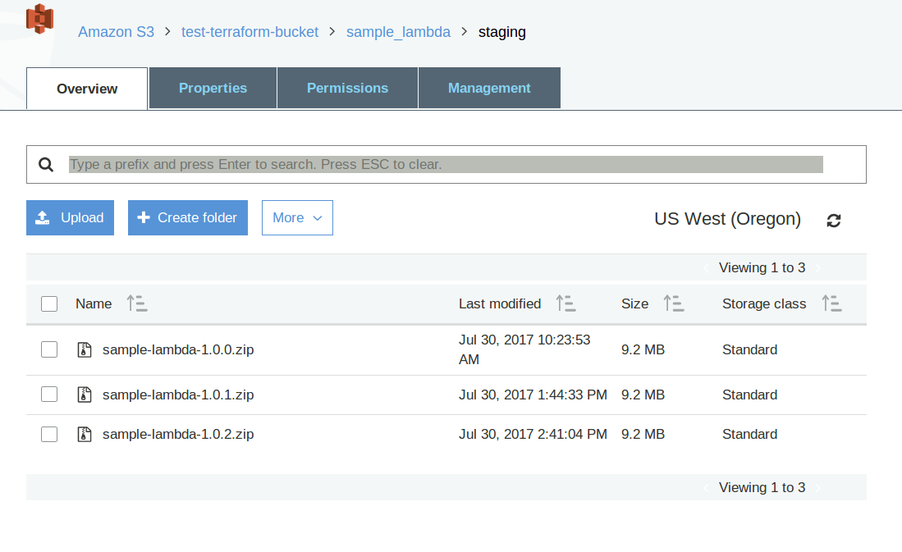
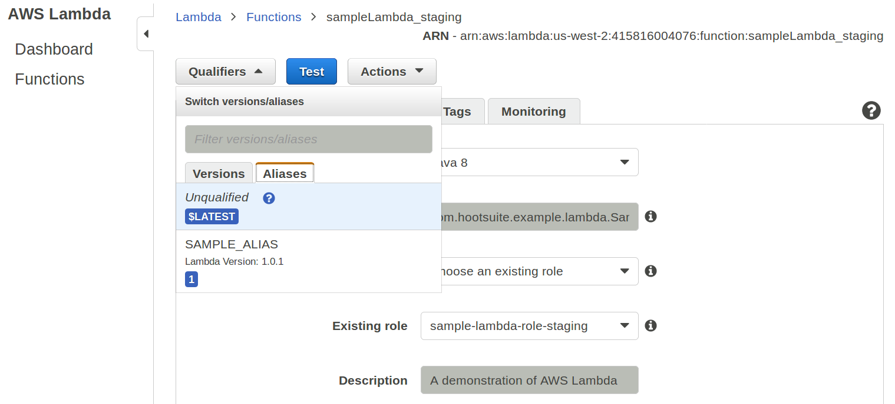
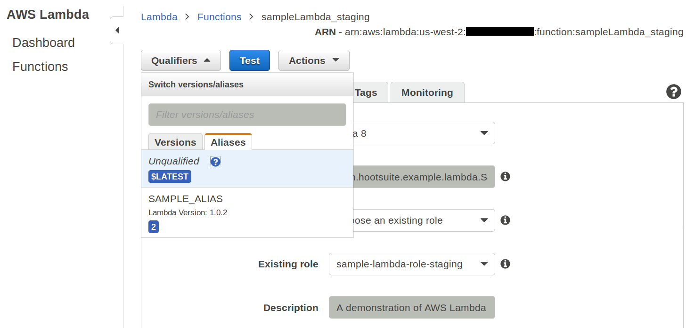
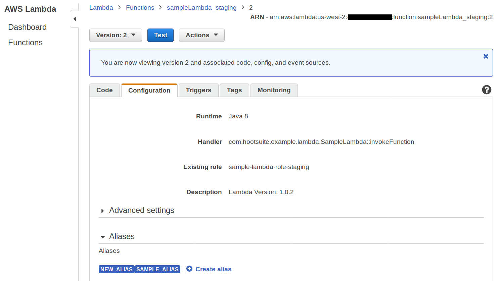

# Sample AWS Lambda Project #

This looked like a very well-documented example of how to deploy [AWS Lambda Functions](https://aws.amazon.com/lambda/), so I decided to follow it as a learning exercise. There are a great number of steps and I thought I would learn something about [Terraform](https://www.terraform.io/) at the very least. The overall intent seems to be a __serverless__ deployment to a __CI__ (Continuous Integration) staging area which includes automated builds and testing followed by a RESTful endpoint for mobile integration, but it's a very long blog post and I may have read the intention(s) incorrectly. The software used was as follows:

Software  | Installed version
--------  | -----------------
boto3     | 1.4.4
Java      | openjdk version "1.8.0_131"
pip       | 9.0.1
Python    | 2.7.12
pyyaml    | 3.12
Terraform | 0.9.11

Just for fun the code was modified to run in the US-WEST-2 region instead of the US-EAST-1 region.

## Table of Contents ##
* [Introduction](#TOC-Introduction)
* [Key Features](#TOC-KeyFeatures)
* [Before You Begin](#TOC-BeforeYouBegin)
* [Installation](#TOC-Installation)
* [Running and Modifying the Function](#TOC-RunModify)
* [Versioning and Aliasing the Function](#TOC-VersionAlias)
* [Using an API Gateway to invoke the Lambda Function](#TOC-APIGateway)
* [Using an API Gateway with Lambda Aliases](#TOC-APIGatewayAlias)
* [License](#TOC-License)
* [Create AWS User to run Terraform](#TOC-CreateUser)

## <a name="TOC-Introduction"></a>Introduction ##

This project is a "Hello, World!" version of the architecture described in [this blog post](http://code.hootsuite.com/accelerating-cross-platform-development-with-serverless-microservices/).

With it you can create an [AWS Lambda Function](https://aws.amazon.com/lambda/) and surrounding IAM infrastructure with [Terraform](https://www.terraform.io/).

The Lambda function is managed with [Gradle](https://gradle.org/) and [boto3](https://github.com/boto/boto3) scripts and runs unit tests with JUnit against your newly deployed function.

The Lambda function code can be found in the `src/main/java/com/hootsuite/example/lambda/SampleLambda.java` file. This code is meant to be a simple example which you can modify to your needs.

## <a name="TOC-KeyFeatures"></a>Key Features ##

This project allows you to:
* Create an AWS Lambda function
* Deploy code to the function from S3
* Manage the AWS infrastructure through Terraform
* Manage the Lambda function through gradle and boto
* Run Unit Tests locally and through the remote Lambda function

## <a name="TOC-BeforeYouBegin"></a>Before You Begin ##

#### AWS ####

You will need an Amazon AWS account, you can sign up [here](https://aws.amazon.com/account/).
 
In order to create the resources in this project, you will need to have permissions to create infrastructure in this account.

*IMPORTANT:* Following the steps in this project may incur a small cost to the associated AWS account.

#### boto3 ####

The AWS Lambda function is managed with Gradle scripts invoking [boto3](https://github.com/boto/boto3) scripts.

* If you do not have `python`, you will need to install it, instructions can be found [here](https://www.python.org/)
* If you do not have `pip`, you will need to install it, instructions can be found [here](https://pip.pypa.io/en/stable/installing/)
* You will need to install `boto3`:
	* From your terminal, enter: `sudo pip install boto3==1.4.4`.

__Update (July 2017):__

Installing this into a single-user system (no 'sudo') was problematic, the following worked:

	$ pip install --user boto3

Many additional dependencies were installed as well. The current version was still __1.4.4__.

#### pyyaml ####

This is a yaml parser for python, used to read the AWS credentials from the configuration files.

* You will need to install `pyyaml`:
	* From your terminal, enter: `sudo pip install pyyaml==3.12`.

__Update (July 2017):__

Installing this into a single-user system (no 'sudo') was problematic, the following worked:

	$ pip install --user pyyaml

The current version was still __3.12__.

#### Terraform ####

The infrastructure in this project is managed using HashiCorp's [Terraform](https://www.terraform.io/)

* You will need to install `terraform`:
	* You can download it from HashiCorp [here](https://www.terraform.io/downloads.html)
	* On macOS, you can also install it with [brew](https://brew.sh/) by entering in the terminal: `brew install terraform`.

__Update (July 2017):__

The current version was __0.9.11__. Installation instructions can be found here:

	https://www.terraform.io/intro/getting-started/install.html

#### Java ####

The AWS Lambda function in this project uses Java 8 and so you will need to install the Java 8 JDK.

* You can follow the installation instructions [here](http://www.oracle.com/technetwork/java/javase/downloads/jdk8-downloads-2133151.html)
* Alternatively, you can use the OpenJDK [here](http://openjdk.java.net/projects/jdk8/)

#### Gradle ####

A starter bundle of Gradle 3.3 is included. Additional dependencies will be downloaded once Gradle is launched.

#### AWS IAM ####

In order to run this project, you will need to create an IAM user with sufficient AWS management permissions.

See the [Create AWS User to run Terraform](#TOC-CreateUser) section of this README for details.

## <a name="TOC-Installation"></a>Installation ##

#### 1. Creating the AWS User to run Terraform ####

See the [Create AWS User to run Terraform](#TOC-CreateUser) section of this README and complete those steps.

#### 2. Creating an S3 Bucket and Folder for the AWS Lambda Resources ####

Here we will create an S3 bucket and folder to hold the AWS Lambda artifacts.

a. In your browser, navigate to `https://console.aws.amazon.com/billing/home?#/account`.

b. Copy the account number you see next to `Account Id:` into the `terraform/env/staging.tfvars` file, on the following line:

	account = "<your-account-number>"

Note that Terraform variables must be quoted (as shown).

c. Choose a unique name for your S3 bucket, into which the Lambda files will be placed. The bucket name has to be unique across all buckets in AWS S3.

d. In the `gradle.properties` file, replace the `<your-bucket-name>` with a unique bucket name for the project.

	bucketName=<your-bucket-name>

e. From the root directory of the project, run the following command. This will create an S3 bucket with the name above, as well as a folder in the bucket for the Lambda resources.

	$ ./gradlew createS3Resources

f. After creating the bucket, you should place your bucket name into the `terraform/env/staging.tfvars` file, on the following line:

	bucket = "<your-bucket-name>"

Now we have an S3 bucket and folder, into which our Lambda code will be placed.

#### 3. Building the initial Java artifact for AWS Lambda ####

Here we will build the `.zip` artifact of the AWS Lambda code.

a. From the root directory run the following command in the terminal. This will compile the AWS Lambda function into a .zip artifact which we will later upload to AWS Lambda.

	$ ./gradlew clean buildZip

b. The build should succeed and you should see `sample-lambda-1.0.0.zip` in the `build/distributions` directory.

Now we have an initial .zip artifact of our Lambda source code which will be uploaded to create the AWS Lambda function.

#### 4. Running Terraform to create staging infrastructure ####

In this step we will create the staging infrastructure in AWS, including our Lambda function, as well as the IAM resources to invoke and manage it.

a. From the project root directory, enter the following command into the terminal:

	$ cd terraform

b. To use terraform to plan the infrastructure that needs to be created, run the following command in your terminal:

	$ terraform plan -var-file="../aws_secrets.tfvars" -var-file="env/staging.tfvars"

c. Ensure that the plan says:

	Plan: 9 to add, 0 to change, 0 to destroy.

This means that 9 resources are to be created when we apply the plan.

d. If the plan is successful, apply it by entering the following command into the terminal:

	$ terraform apply -var-file="../aws_secrets.tfvars" -var-file="env/staging.tfvars"

[This may take a minute of two to execute.]

e. If the apply is successful, you should see the following:

	The state of your infrastructure has been saved to the path
	below. This state is required to modify and destroy your
	infrastructure, so keep it safe. To inspect the complete state
	use the `terraform show` command.

Also, a __terraform.tfstate__ file should be created. This may be viewed with `terraform show`.

Now we have created the infrastructure in AWS which will we use to run and manage the Lambda function.

#### 5. Extracting the IAM user for invoking the AWS Lambda Function ####

Here we will extract the credentials from the newly created user which only has permissions to invoke the Lambda function. We will use this user with our Java test client to invoke the function.

a. In the terminal enter:

	$ terraform show

b. You can scroll through the output and you should see that two sets of access keys have been created.

c. Look for the following block with `sample_lambda_invoker` in the output, with `<id>` and `<password>` being the real id and password in your output:

	aws_iam_access_key.sample_lambda_invoker:
	  id = <id>
	  secret = <secret>
	  ses_smtp_password = <password>
	  status = Active
	  user = sample_lambda_invoker_staging

d. This user has been created to only invoke the Lambda function and so we need to place it in the Java code where the unit tests will eventually invoke our AWS Lambda function.

e. Copy the value of the `<id>` and the `<secret>`.

f. Place them, in order, on line 16 of the `AwsLambdaCredentialsProvider` java class in the `src/test/java/com/hootsuite/example/lambda/environment/` folder.

g. The line should look like:

	return new BasicAWSCredentials("<id>", "<secret>");

Replace the `<id>` with the generated id and `<secret>` with the generated secret.

Now we have given permissions to the unit tests to invoke our Lambda function.

#### 6. Extracting the IAM user for managing the AWS Lambda Function ####

Here we will extract the user we use to manage the Lambda function. The user is named `sample_lambda_jenkins`. This is because in our production Lambda deployment, we are using [Jenkins](https://jenkins.io/) to run jobs which manage our Lambda code. The credentials generated here are embedded in our Jenkins machine. For this simple introduction, you will play the role of Jenkins, managing the AWS Lambda function yourself.

a. From the `terraform` directory, run the following command again:

	$ terraform show

b. Now look for the following block.

	aws_iam_access_key.sample_lambda_jenkins:
	  id = <id>
	  secret = <secret>
	  ses_smtp_password = <password>
	  status = Active
	  user = sample_lambda_jenkins_staging

c. Again copy the `<id>` and `<secret>` values.

d. This time, we will place them in the `aws_credentials.yml` file. The file should look like:

	staging_access_key = "<id>"
	staging_secret_key = "<secret>"
	
	production_access_key = ""
	production_secret_key = ""

e. Place your `<id>` and `<secret>` into the file where marked above. For now, ignore the production access key and secret key as we are only creating a staging environment in this example.

Now we have a user which has permissions to manage the Lambda function which will be used when we invoke the boto3 scripts through gradle tasks.

#### 7. Uploading the Artifact to S3 ####

Now that we have a user with permissions to do so, we will upload our artifact to S3.

a. Return to the project's root directory:

	$ cd ..

b. From the root project directory run the following command in the terminal:

	$ ./gradlew uploadStaging

* The artifact we compiled should now be uploaded to S3.

__Update (July 2017):__

This build process is not reassuring:

	$ ./gradlew uploadStaging
	Testing in environment: LOCAL
	:generateGrammarSource UP-TO-DATE
	:compileJava UP-TO-DATE
	:processResources UP-TO-DATE
	:buildZip UP-TO-DATE
	:uploadStaging
	null
	
	BUILD SUCCESSFUL
	
	Total time: 1 mins 31.313 secs
	$

The upload can be verified from the S3 console:



[It may be necessary to hit the refresh icon a few times.]

Once the upload is complete it is possible to test:

	$ ./gradlew clean -PtestEnvironment=STAGING test

Note that the build will fail as only two of the tests will succeed.

#### 8. Modifying our Lambda to pull the artifact from S3 ####

Currently, our AWS Lambda function uses an artifact uploaded directly to AWS Lambda. In order to effectively manage and version our Lambda function, we will need to change the function to pull code from the S3 bucket we previously created.

a. In the `terraform/main.tf` file. Comment out line 4 with `//` or `#`:

	   filename = "../build/distributions/sample-lambda-1.0.0.zip"

b. Also uncomment lines 5 and 6 in the file.

	s3_bucket = "${var.bucket}"
	s3_key = "sample_lambda/${var.env}/sample-lambda-1.0.0.zip"

c. Switch to the `terraform` directory in your terminal:

	cd terraform

d. We will now re-run the planning stage to change the infrastructure. Enter the following in the terminal:

	$ terraform plan -var-file="../aws_secrets.tfvars" -var-file="env/staging.tfvars"

e. This time, you should only see that there is only 1 resource to change:

	~ aws_lambda_function.sample_lambda
	    filename:  "../build/distributions/sample-lambda-1.0.0.zip" => ""
	    s3_bucket: "" => "<your bucket name>"
	    s3_key:    "" => "sample_lambda/staging/sample-lambda-1.0.0.zip"
	
	
	Plan: 0 to add, 1 to change, 0 to destroy.

f. If the plan is successful, apply it by entering the following command into the terminal:

	terraform apply -var-file="../aws_secrets.tfvars" -var-file="env/staging.tfvars"

g. If the apply is successful, you should see the following:

	The state of your infrastructure has been saved to the path
	below. This state is required to modify and destroy your
	infrastructure, so keep it safe. To inspect the complete state
	use the `terraform show` command.

This should also create a __terraform.tfstate__ file after copying the previous terraform.tfstate file to __terraform.tfstate.backup__.

Now we have our function set to pull artifacts from S3 to run. This means that we should no longer need terraform to manage our Lambda function. From now on we will only use gradle tasks which invoke boto3 scripts underneath.

## <a name="TOC-RunModify"></a>Running and Modifying the Function ##

#### 9. Running the Tests to ensure deployment ####

Here we will run the unit tests from `src/test/java/com/hootsuite/example/lambda/SampleTest.java`. These tests can be configured to run locally (without going through the Lambda function) or end-to-end (through the Lambda function).

a. Switch to the root directory of the project in your terminal.

	$ cd ..

b. From the project root directory, run the following command in the terminal:

	$ ./gradlew clean -PtestEnvironment=LOCAL test

You should see that two of the local unit tests pass and two fail. You can look at the `src/main/java/com/hootsuite/example/lambda/SampleLambda.java` file. Right now we're only outputting either "ZERO" or "GREATER THAN ZERO" based on the input. We'll fix those other two tests later.

c. From the project root directory, run:

	$ ./gradlew clean -PtestEnvironment=STAGING test

These tests are hitting the newly deployed Lambda! Again, two will pass and two will fail.

These are the first invocations of your Lambda function.

#### 10. Modifying the Lambda function to fix the breaking tests ####

Now we will modify the Lambda function code so that it exhibits the expected behaviour.

a. First we'll change the Lambda function. In `src/main/java/com/hootsuite/example/lambda/SampleLambda.java` comment out line 9 and uncomment lines 11-16 inclusive, so that the lines look like the following:

	//         return (request.getInput() == 0) ? "ZERO" : "GREATER THAN ZERO";
	        // TODO STEP 10 Comment out the line above and uncomment the lines below
	        switch (request.getInput()) {
	            case 0: return "ZERO";
	            case 2: return "TWO";
	            case 3: return "THREE";
	            default: return "GREATER THAN ZERO";
	        }

Notice that we are now adding the expected behaviour of outputting the numbers "TWO" and "THREE".

In the real world this could be fixing a bug that was previously deployed.

b. From the project root directory, run:

	$ ./gradlew clean -PtestEnvironment=LOCAL test

The build should succeed since the tests now all pass as we've fixed them locally.

c. From the project root directory, run:

	$ ./gradlew clean -PtestEnvironment=STAGING test

The two tests should still be failing since we haven't yet uploaded the new code to AWS Lambda.

#### 11. Updating the AWS Lambda code ####

a. Update the version of the code in the `build.gradle` file on line 6 from __1.0.0__ to __1.0.1__:

	buildscript {
	    ext {
	        version = '1.0.1'

b. From the project root directory, run:

	$ ./gradlew clean updateFunctionCodeStaging

The above command will build a new zip file, version 1.0.1, and then upload it to S3. Our AWS Lambda Function will be updated to pull this new code from S3.

Our unit-testing client is set to invoke the latest version of the Lambda Function code, later we will see how we can lock clients to Aliases and versions.

This one command is all that is needed to update the Lambda function code. After the initial runs Terraform is not needed to manage the function.

c. From the project root directory run:

	$ ./gradlew clean -PtestEnvironment=STAGING test

The tests should pass now with the new version of the function code deployed.

## <a name="TOC-VersionAlias"></a>Versioning and Aliasing the Function ##

This section assumes that you have completed the the [Installation](#TOC-Installation) section above.

In that section, we created a Lambda function with Terraform and updated it using Gradle and boto.

However, we are still pushing our Lambda code to the __$LATEST__ bucket. In this section we will use [Versioning and Aliases](http://docs.aws.amazon.com/lambda/latest/dg/versioning-aliases.html) to target specific versions of our Lambda function.

#### 1. Publish a Version and Alias of the current Lambda code ####

First we will publish Version 1 of our Lambda function.

a. From the root directory run:

	$ ./gradlew publishLambdaStaging

The build should be successful and the version should be 1 as shown in the snippet below.
 
	    "Description": "Lambda Version: 1.0.1",
	
	    <...>
	
	    "Runtime": "java8",
	    "Timeout": 10,
	    "TracingConfig": {
	        "Mode": "PassThrough"
	    },
	    "Version": "1"
	}
	
	BUILD SUCCESSFUL

Now we will create an alias pointing to this particular version.

b. From the root directory run:

	$ ./gradlew createAliasStaging -PaliasName=SAMPLE_ALIAS -PlambdaVersion=1

This will create an alias named `SAMPLE_ALIAS` and point that at the Version 1 you just published.

You should see that the build succeeded with the following snippet in the output:

	    "Description": "Lambda Version: 1.0.1",
	    "FunctionVersion": "1",
	    "Name": "SAMPLE_ALIAS",
	    "ResponseMetadata": {

Now we will change the test client to invoke the `SAMPLE_ALIAS` version of the Lambda.

c. In the `src/test/java/com/hootsuite/example/lambda/environment/AWSLambdaInvoker.java` file, uncomment the line shown below to invoke the Function with the given alias.

	                // TODO Uncomment to invoke Lambda with Alias
	//                .withQualifier(ALIAS)
	                .withFunctionName(getFunctionName());

d. Run the unit tests and ensure that they are all still passing:

	$ ./gradlew clean -PtestEnvironment=STAGING test

#### 2. Change the Tests to add new behaviour ####

Now we will add new expected behaviour to our Lambda function.

In the real world, this could correspond to fixing a bug that surfaced after publishing our Lambda client.

a. In the `src/test/java/com/hootsuite/example/lambda/SampleTest.java` file, uncomment the lines shown below to add a new test.

	    // TODO Uncomment to add a new test
	    @Test
	    public void fourTest() {
	        assertEquals(STRING_MISMATCH, "FOUR", lambdaGenerator.invoke(new SampleLambdaRequest(4)));
	    }

b. Now run the unit tests and see that the new test is failing:

	$ ./gradlew clean -PtestEnvironment=STAGING test

Next, we will modify our function and redeploy it to fix the failing test.

#### 3. Update the Function Code Behavior ####

a. In the `src/main/java/com/hootsuite/example/lambda/SampleLambda.java` file, uncomment the lines below and comment out the rest of the function above.

	        // TODO Comment out the lines above and uncomment the lines below
	        switch (request.getInput()) {
	            case 0: return "ZERO";
	            case 2: return "TWO";
	            case 3: return "THREE";
	            case 4: return "FOUR";
	            default: return "GREATER THAN ZERO";
	        }

Now we have added the functionality our tests expect.  

b. Run the following and verify that all 5 tests now pass.

	$ ./gradlew clean -PtestEnvironment=LOCAL test

c. Update the function version in the `build.gradle` file to __1.0.2__:

	buildscript {
	    ext {
	        version = '1.0.2'

d. Upload the new function code to Staging:

	$ ./gradlew updateFunctionCodeStaging

e. Run the unit tests in the Staging Environment:

	$ ./gradlew clean -PtestEnvironment=STAGING test
 
One test should fail.

If we check our __S3__ dashboard, we will see that all three versions are present:



If we check our __Lambda__ dashboard, we will see that our alias still points to __1.0.1__:



Now that we have set our Java client to invoke the function alias, we will need to update the alias to fix the broken test.
 
#### 4. Update the Alias ####
 
First we will publish a new version of the function and update the alias to point to the new version.

a. From the root directory run:

	$ ./gradlew publishLambdaStaging

The build should be successful and the version should be 2 as shown in the snippet below.

	    "Description": "Lambda Version: 1.0.2",
	
	    <...>
	
	    "Runtime": "java8",
	    "Timeout": 10,
	    "TracingConfig": {
	        "Mode": "PassThrough"
	    },
	    "Version": "2"
	}
	
	BUILD SUCCESSFUL

Next we will update the alias to point to this version.

b. From the root directory run:

	$ ./gradlew updateAliasStaging -PaliasName=SAMPLE_ALIAS -PlambdaVersion=2

This will update the `SAMPLE_ALIAS` alias to point to the Version 2 that was just published.

You should see that the build succeeded with the following snippet in the output:

	    "Description": "Lambda Version: 1.0.2",
	    "FunctionVersion": "2",
	    "Name": "SAMPLE_ALIAS",
	    "ResponseMetadata": {

If we check our __Lambda__ dashboard, we will see that our alias now points to __1.0.2__:



c. Now run the unit tests again by running:

	$ ./gradlew clean -PtestEnvironment=STAGING test

This time all 5 tests should pass as the alias now points to the correct version of the function.

The benefit of using aliases is that they are __mutable__: they can be updated to point to a new version of the function code and the client will automatically invoke the new version without needing to be updated.

## <a name="TOC-APIGateway"></a>Using an API Gateway to invoke the Lambda Function ##

This section assumes you have previously completed the steps in the [Versioning and Aliasing](#TOC-VersionAlias) section above.

In this section we will create an [API Gateway](https://aws.amazon.com/api-gateway/) which invokes the Lambda function we created in the previous steps. We will then be able to invoke the Lambda function with REST calls.
 
#### 1. Run Terraform to create API Gateway Infrastructure ####
 
a. In the `terraform/gateway.tf` file, uncomment the contents of the file.

b. In your terminal, navigate to the `terraform` directory:

	$ cd terraform

c. Run the terraform plan:

	$ terraform plan -var-file="../aws_secrets.tfvars" -var-file="env/staging.tfvars"
 
If successful, you should see: 

	Plan: 9 to add, 0 to change, 0 to destroy.

__Update (July 2017):__

For whatever reason, I got the following:

	Plan: 18 to add, 0 to change, 0 to destroy.

d. Apply the plan:

	$ terraform apply -var-file="../aws_secrets.tfvars" -var-file="env/staging.tfvars"

__Update (July 2017):__

Annoyingly, I got the following:

	Apply complete! Resources: 9 added, 0 changed, 0 destroyed.

Why annoyingly? Because __terraform__ had just told me there were __18__ resources to add. Bug?

#### 2. Use curl to invoke the Lambda function through the API Gateway. ####

In the output of the previous apply, you should see a `aws_api_gateway_deployment.sample_lambda_deployment` section.

In that section, look for `rest_api_id`.

a. Copy the `rest_api_id`, it should look something like `c8gm8f8us9`.

b. In the terminal enter the following curl command, replacing `<rest_api_id>` with the id you just copied.

	$ curl -d '{"input": 4}' -H "Content-Type: application/json" \
	       -X POST https://<rest_api_id>.execute-api.us-west-2.amazonaws.com/staging/sample_lambda

You should see `"FOUR"` as the output, just as if you had invoked the Lambda function directly.

## <a name="TOC-APIGatewayAlias"></a>Using an API Gateway with Lambda Aliases ##

This section assumes you have previously completed the steps in the [Using API Gateway](#TOC-APIGateway) section above.

In the previous section we saw that we could create an API Gateway which allowed us to invoke our AWS Lambda function through REST calls. We tested this by using curl to send a request to our API Gateway.

In this section we will see how we can set up API Gateway deployments to point to AWS Lambda aliases.

This will allow us to call our API as follows:

	$ curl ... https://<rest_api_id>.execute-api.us-west-2.amazonaws.com/SAMPLE_ALIAS/sample_lambda

Rather than as follows:

	$ curl ... https://<rest_api_id>.execute-api.us-west-2.amazonaws.com/staging/sample_lambda

As we have seen, the alias `SAMPLE_ALIAS` may be easily configured to point to a specific version of our code.

This should give us more operational flexibility.

#### 1. Use Terraform to Create a New API Gateway Deployment ####

a. In the `terraform/deployments.tf` file, uncomment the contents of the file.

There are two blocks in this file, one is the gateway deployment and the other is the permission for the API Gateway to invoke the given Lambda alias.

The first block is used to expose the Lambda's alias through a specified request URL path.

The second is to allow the Lambda function to be invoked through calls to the API Gateway.

b. Navigate to the `terraform` directory:

	$ cd terraform

c. Run the terraform plan:

	$ terraform plan -var-file="../aws_secrets.tfvars" -var-file="env/staging.tfvars"

If successful, you should see: 

	Plan: 3 to add, 0 to change, 1 to destroy.

__Update (July 2017):__

For whatever reason, I got the following:

	Plan: 5 to add, 0 to change, 1 to destroy.

d. Apply the plan:

	$ terraform apply -var-file="../aws_secrets.tfvars" -var-file="env/staging.tfvars"

__Update (July 2017):__

Annoyingly, I got the following:

	Apply complete! Resources: 3 added, 0 changed, 1 destroyed.

Close enough!

#### 2. Use curl to invoke the Lambda function through API Gateway. ####

In the output of the previous apply, you should see a `aws_api_gateway_deployment.sample_lambda_deployment` section.

In that section, look for `rest_api_id`.

a. Copy the `rest_api_id`, it should look something like `c8gm8f8us9`.

b. In the terminal enter the following curl command, replacing `<rest_api_id>` with the id you just copied.

	$ curl -d '{"input": 4}' -H "Content-Type: application/json" \
	       -X POST https://<rest_api_id>.execute-api.us-west-2.amazonaws.com/SAMPLE_ALIAS/sample_lambda

You should see `"FOUR"` as the output, just as if you had invoked the Lambda function directly.

#### 3. Create additional Gateway deployments for new aliases. ####

If you wanted to add additional deployments for different Lambda aliases, you could do so by creating a new Lambda alias and adding two blocks to the `terraform/deployments.tf` file.

We will create a new Lambda alias, `NEW_ALIAS` to point to the same Lambda version as `SAMPLE_ALIAS`. [In a real production environment they would point to two different versions. Hopefully they would not be named `PRODUCTION` and `STAGING`.]

This will allow us to call our API as follows:

	$ curl ... https://<rest_api_id>.execute-api.us-west-2.amazonaws.com/NEW_ALIAS/sample_lambda

Rather than as follows:

	$ curl ... https://<rest_api_id>.execute-api.us-west-2.amazonaws.com/SAMPLE_ALIAS/sample_lambda

Or as follows:

	$ curl ... https://<rest_api_id>.execute-api.us-west-2.amazonaws.com/staging/sample_lambda

a. Return to the root project directory:

	$ cd ..

b. From the root project directory run:

	$ ./gradlew createAliasStaging -PaliasName=NEW_ALIAS -PlambdaVersion=2

You should see that the build is successful and we now have a new alias, `NEW_ALIAS`, for our Lambda function.



Next we will add two blocks to the `terraform/deployments.tf` file. Whenever you wish to invoke a new alias from the API Gateway, you will need to add these two blocks.

The first is for the actual API Gateway deployment to invoke the given alias. The other gives permission to the API Gateway to invoke the Lambda alias of your function.

If you add your own alias, you will need to change all instances of `NEW_ALIAS` to your new alias. 

c. Add the code blocks below to the `terraform/deployments.tf` file.  

	resource "aws_api_gateway_deployment" "sample_lambda_deployment_NEW_ALIAS" {
	  depends_on = ["aws_api_gateway_integration.sample_lambda_integration"]
	
	  rest_api_id = "${aws_api_gateway_rest_api.sample_lambda_api.id}"
	  stage_name = "NEW_ALIAS"
	
	  variables {
	    "lambdaAlias" = "NEW_ALIAS"
	  }
	
	  # forces a new deployment each run
	  stage_description = "${timestamp()}"
	}
	
	resource "aws_lambda_permission" "sample_lambda_permission_NEW_ALIAS" {
	  statement_id = "AllowExecutionFromAPIGateway"
	  action = "lambda:InvokeFunction"
	  function_name = "${aws_lambda_function.sample_lambda.arn}"
	  principal = "apigateway.amazonaws.com"
	
	  source_arn = "arn:aws:execute-api:${var.region}:${var.account}:${aws_api_gateway_rest_api.sample_lambda_api.id}/*/*/*"
	
	  qualifier = "NEW_ALIAS"
	}

After adding the blocks, you will need to run terraform again to create the additional infrastructure.

d. Navigate to the `terraform` directory:

	$ cd terraform

e. Run the terraform plan:

	$ terraform plan -var-file="../aws_secrets.tfvars" -var-file="env/staging.tfvars"

If successful, you should see: 

	Plan: 4 to add, 0 to change, 2 to destroy.

__Update (July 2017):__

As usual, a slight discrepancy:

	Plan: 6 to add, 0 to change, 2 to destroy.

[This looks like a bug, only four items are listed, 2 with +/-.]

f. Apply the plan:

	$ terraform apply -var-file="../aws_secrets.tfvars" -var-file="env/staging.tfvars"
 
__Update (July 2017):__

As usual, a slight discrepancy:

	Apply complete! Resources: 4 added, 0 changed, 2 destroyed.

It looks like the above discrepancy really was a bug.

g. After running terraform your new alias will be part of the URL path: 

	https://<rest_api_id>.execute-api.us-west-2.amazonaws.com/NEW_ALIAS/sample_lambda

You can then curl the new alias with the curl call below:

	$ curl -d '{"input": 4}' -H "Content-Type: application/json" \
	       -X POST https://<rest_api_id>.execute-api.us-west-2.amazonaws.com/NEW_ALIAS/sample_lambda

h. Once again you should see `"FOUR"` as the curl result.

If you add your own Lambda Alias deployments to the API Gateway, they will each have their own path.

## <a name="TOC-License"></a>License ##

This project is released under the Apache License, Version 2.0. See [LICENSE](LICENSE) for details.

## <a name="TOC-CreateUser"></a>Create AWS User to run Terraform

#### 1. Sign into the AWS Console and navigate to IAM Management for US-West-2 ####

a. In a browser window, navigate to `https://console.aws.amazon.com/console/home`. Sign into the console.

b. After signing in, navigate to `https://console.aws.amazon.com/iam/home?region=us-west-2#/home`. This is where we will create the user we need to run Terraform to manage our AWS Infrastructure.

Now that you are signed in, we create the user.

#### 2. Create the User ####

a. Click on `Users` in the side bar, see the image below.


b. Click on `Add user` as shown in the image below.


c. Type the name of the user `sample_lambda_manager` into the User name field and check the `Programmatic access` box. See the image below.

d. Click the `Next: Permissions` box to proceed.


e. As shown in the image below, tap on `Attach existing policies directly`.


f. Now click the `Create policy` button as shown below.


This should open a new browser window where we will create the policy that your Terraform user will need to create and manage the project infrastructure.

#### 3. Creating the Policy to Attach to the Terraform User ####

a. In the new tab, click `Select` next to `Create Your Own Policy` as shown below.


b. In the next screen, enter the name of the policy `sample_lambda_terraform` and a short description. This is shown in the image below.


c. Where it says `<paste policy here>`, paste the JSON snippet below.

```json
{
    "Version": "2012-10-17",
    "Statement": [
        {
            "Sid": "LambdaCreateLogs",
            "Effect": "Allow",
            "Action": [
                "logs:CreateLogGroup",
                "logs:CreateLogStream",
                "logs:PutLogEvents"
            ],
            "Resource": "*"
        },
        {
            "Sid": "S3Management",
            "Effect": "Allow",
            "Action": [
                "s3:CreateBucket",
                "s3:PutObject",
                "s3:GetBucketLocation",
                "s3:GetObject",
                "s3:GetObjectAcl",
                "s3:GetObjectVersion",
                "s3:ListAllMyBuckets",
                "s3:ListBucket",
                "s3:ListBucketVersions",
                "s3:PutObject"
            ],
            "Resource": [
                "*"
            ]
        },
        {
            "Sid": "Stmt1490105011000",
            "Effect": "Allow",
            "Action": [
                "lambda:AddPermission",
                "lambda:CreateFunction",
                "lambda:GetFunction",
                "lambda:GetFunctionConfiguration",
                "lambda:CreateAlias",
                "lambda:DeleteAlias",
                "lambda:GetAlias",
                "lambda:GetPolicy",
                "lambda:InvokeFunction",
                "lambda:ListAliases",
                "lambda:ListVersionsByFunction",
                "lambda:PublishVersion",
                "lambda:RemovePermission",
                "lambda:UpdateAlias",
                "lambda:UpdateFunctionCode"
            ],
            "Resource": [
                "*"
            ]
        },
        {
            "Sid": "Stmt1490105149000",
            "Effect": "Allow",
            "Action": [
                "iam:AttachRolePolicy",
                "iam:AttachUserPolicy",
                "iam:CreateAccessKey",
                "iam:CreatePolicy",
                "iam:CreatePolicyVersion",
                "iam:CreateRole",
                "iam:CreateUser",
                "iam:GetRole",
                "iam:GetRolePolicy",
                "iam:GetUser",
                "iam:GetUserPolicy",
                "iam:ListAccessKeys",
                "iam:ListPolicies",
                "iam:ListUserPolicies",
                "iam:ListUsers",
                "iam:PutUserPolicy",
                "iam:PassRole",
                "iam:PutRolePolicy"
            ],
            "Resource": [
                "*"
            ]
        },
        {
            "Sid": "APIGatewayManagement",
            "Effect": "Allow",
            "Action": [
                "apigateway:POST",
                "apigateway:GET",
                "apigateway:PUT",
                "apigateway:DELETE"
            ],
            "Resource": [
                "*"
            ]
        }
    ]
}
```

__Update (July 2017):__

Not being sure what Stmt1490105011000 (Lambda) or Stmt1490105149000 (IAM) were, I tried to manually create a policy using the __Policy Generator__. However, the various options proved hard to find and "LambdaCreateLogs" turned out to be impossible to find. So in the end I simply pasted in the JSON as instructed.

d. Now click on the `Create Policy` button and we are done creating the policy, you can close the tab.

#### 4. Attaching the Policy to the Terraform User ####

Now that we have created the policy we will attach it to the user.

a. Click `Refresh` to refresh the list of policies to include our newly created policy.


b. Type the name of our policy as shown below: `sample_lambda_terraform`.

__Update (July 2017):__

A simpler option is to select "Customer managed" from the Filter pulldown.


c. Check the box next to the policy as shown below and then click `Next: Review`.


d. On the next screen, click `Create User` as shown below.


Now we have our user, we only need to copy the keys to this project.

#### 5. Copy the newly created keys to this project ####

a. As shown in the image below, copy the `Access key ID` of the newly created user.


b. Open up the `aws_secrets.tfvars` file in the root directory of this project and replace the `<your_access_key>` with your copied access key. The file is shown below:

	access_key = "<your_access_key>"
	secret_key = "<your_secret_key>"

c. As shown in the image above, click `Show` to reveal the Secret Key of the user, copy it and place it into the `<your_secret_key>` in the file as well.

d. Click `Close` and you're finished creating your IAM user to manage AWS infrastructure with Terraform! You should now be able to proceed with the [Installation](#TOC-Installation) section above.
